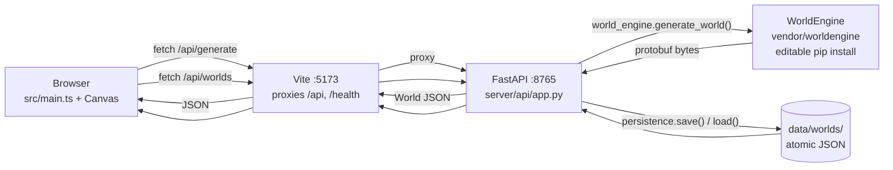
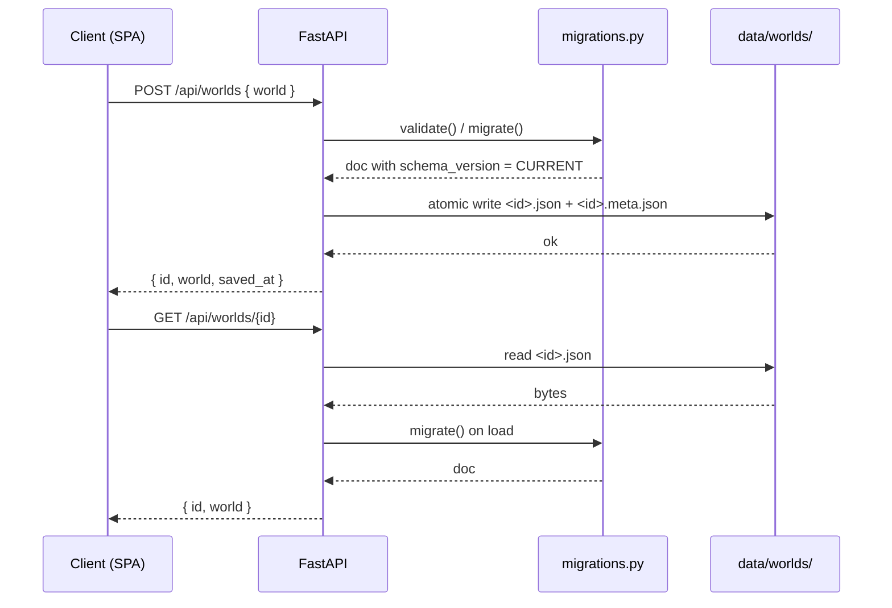
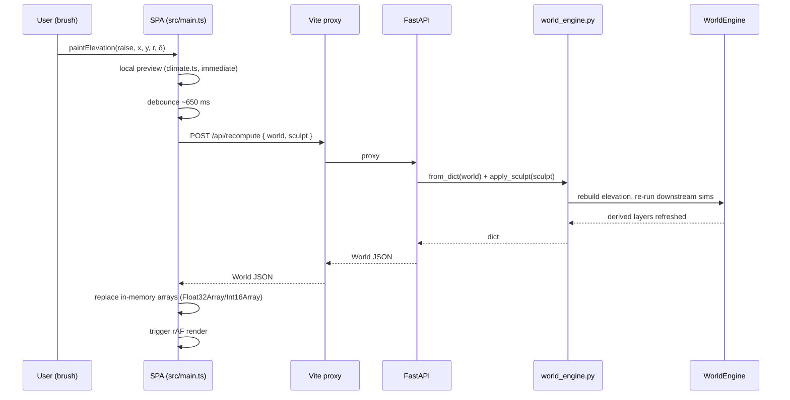

# Architecture

One-page reference for Geoform's runtime flows. The authoritative API contract lives in [`contract.md`](contract.md); this document focuses on *how* requests move through the system.

## Runtime request flow

The SPA is served by Vite in dev (port 5173) or by any static host in production. The API is always FastAPI on port 8765. Vite proxies `/api/*` and `/health` to keep the browser same-origin.



Equivalently, in plain ASCII:

```
browser ─► Vite :5173 ─► FastAPI :8765 ─► WorldEngine (numpy + PyPlatec)
                  ▲                  │
                  └──── JSON ◄───────┘
                                     │
                       data/worlds/ ◄┘   (only for /api/worlds*)
```

`/api/generate` runs `worldengine.plates.world_gen` plus the full downstream simulation chain (temperature, precipitation, erosion, watermap, irrigation, humidity, permeability, biome, icecap) inside a worker thread, bounded by `GEOFORM_GENERATE_TIMEOUT_MS`. `/api/recompute` skips the plate sim and replays downstream layers after applying the client's `sculpt[]` strokes.

## Save / load flow

Saves go to `<GEOFORM_DATA_DIR>/worlds/<id>.json` (the full migrated World document) plus a sibling `<id>.meta.json` carrying `{id, name, width, height, seed, saved_at}`. Writes are atomic (`write-to-tmp` + `os.replace`).



The migration walker in `server/api/migrations.py` is invoked on **every** load (and on save, for inbound payloads), so a stale on-disk file with an older `schema_version` is upgraded transparently before being returned to the client.

## Sculpt → recompute flow

When the user paints heightfield strokes, the SPA sends the full world back to `/api/recompute` (the server is authoritative — the TS-side climate preview is just a fast in-browser approximation).



The `sculpt[]` array is a list of brush strokes `{x, y, radius, delta, tool}`. On recompute the server applies them in order to a fresh elevation layer generated from the saved seed, then runs the full downstream sim — this keeps determinism without storing the full edit history.

## Boundaries

- **Browser** owns the heightfield, the canvas, autosave, and user input.
- **FastAPI** owns simulation, settlement rules, persistence, and migrations.
- **WorldEngine** owns tectonic and climate numerics; it never reaches into the network or the disk.
- **Disk** owns durability — it is the only state that survives a restart.
